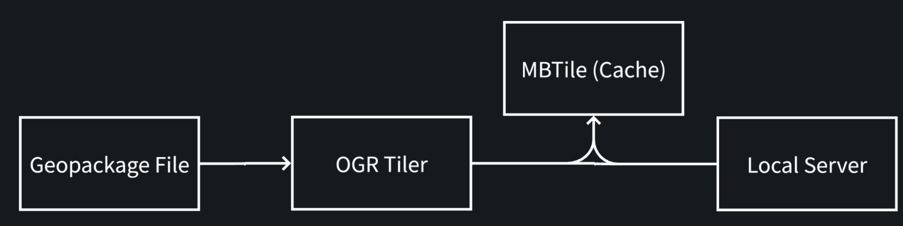

# OGR Tiler

A dynamic vector tile generation service that converts OGR-compatible geospatial data formats into Mapbox Vector Tiles (MVT) on-the-fly.

[](https://pypi.org/project/ogr-tiller/)
[](https://www.python.org/downloads/)

## Overview

**OGR Tiler** is a lightweight, development-focused vector tile server that enables cartographers and geospatial developers to quickly prototype maps without relying on commercial services like Mapbox.

### Key Features

- **Dynamic Tile Generation**: Converts GeoPackage, Shapefile, GeoJSON, and other OGR formats to MVT on-the-fly
- **Flexible Caching**: Optional tile pre-generation and caching using MBTile format
- **Three Operating Modes**: Serve dynamic tiles, build cache, or serve cached tiles only
- **Auto-Generated Styles**: Automatic Mapbox GL style generation for quick visualization
- **CRS Agnostic**: Handles input data in any coordinate system, outputs Web Mercator tiles
- **YAML Configuration**: Per-tileset customization via manifest files
- **REST API**: Standard TileJSON and MVT endpoints compatible with MapLibre GL and Mapbox GL
- **CORS Enabled**: Ready for cross-origin requests from web applications



## Target Users

Ideal for **cartographers** and **geospatial developers** who need:
- Quick prototyping of vector tile visualizations
- Local development without external dependencies
- Custom tile generation from proprietary data sources
- Lightweight alternative to commercial tile services

**Note**: This tool is optimized for development workflows, not production-scale serving.

## Technology Stack

- **FastAPI**: Async REST API framework
- **Fiona**: OGR wrapper for reading geospatial data
- **Shapely**: Geometric operations and spatial analysis
- **Mapbox Vector Tile**: Protocol Buffer encoding for MVT
- **PyProj**: Coordinate reference system transformations
- **More Cantile**: Web Mercator tile math utilities
- **SQLite3**: MBTile cache storage
- **Rich**: Terminal UI with progress bars

## Installation

### From PyPI (Recommended)

```bash
pip install ogr_tiller -U
```

### From Source

```bash
git clone https://github.com/geoyogesh/ogr_tiller.git
cd ogr_tiller
pip install -e .
```

### Development Environment (Conda)

```bash
conda create -n ogr_tiller -y
conda activate ogr_tiller
conda config --env --add channels conda-forge
conda config --env --set channel_priority strict
conda install python=3 fiona mapbox-vector-tile rtree pyproj -y
pip install -e .
```

## Quick Start

### 1. Prepare Your Data

Place your GeoPackage (`.gpkg`) files in a data folder:

```bash
mkdir -p data
# Add your .gpkg files to the data folder
```

### 2. Start the Server

**Dynamic tile serving with caching:**
```bash
ogr_tiller --data_folder ./data/ --cache_folder ./cache/ --port 8080
```

**Dynamic serving without caching:**
```bash
ogr_tiller --data_folder ./data/ --cache_folder ./cache/ --port 8080 --disable_caching true
```

### 3. View Your Tiles

Open your browser to `http://localhost:8080` to see available tilesets and styles.

Use the test viewer at `test/test.html` or integrate with MapLibre GL:

```javascript
const map = new maplibregl.Map({
    container: 'map',
    style: 'http://localhost:8080/styles/system/starter.json',
    center: [0, 0],
    zoom: 2
});
```

## Operating Modes

### Serve Mode (Default)

Dynamic tile generation with optional caching for development:

```bash
ogr_tiller --data_folder ./data/ --cache_folder ./cache/ --port 8080
```

**Options:**
- `--tile_timeout`: Timeout for tile generation in seconds (default: 3)
- `--disable_caching`: Set to `true` to bypass cache and always generate fresh tiles

### Build Cache Mode

Pre-generate all tiles for all zoom levels (0-24 or configured range):

```bash
ogr_tiller --mode build_cache --data_folder ./data/ --cache_folder ./cache/
```

This recursively generates tiles using a quadtree descent and stores them in MBTile databases.

### Serve Cache Mode

Serve only pre-generated cached tiles (read-only, production-safe):

```bash
ogr_tiller --mode serve_cache --data_folder ./data/ --cache_folder ./cache/ --port 8080
```

Returns 404 for any tiles not in the cache.

## Configuration

### Manifest File

Create a `manifest.yml` in your data folder to customize tile generation:

```yaml
config:
  defaults:
    minzoom: 0
    maxzoom: 18
    extent: 4096
    tile_buffer: 64
    simplify_tolerance: 1.0
    attribution: "© Your Organization"

  tilesets:
    my_tileset:
      minzoom: 5
      maxzoom: 16
      name: "My Custom Tileset"
      attribution: "© Custom Attribution"
```

**Parameters:**
- `minzoom/maxzoom`: Zoom level range (0-24)
- `extent`: Vector tile extent in pixels (default: 4096)
- `tile_buffer`: Buffer around tiles for clipping in pixels (default: 64)
- `simplify_tolerance`: Geometry simplification factor (default: 1.0)
- `attribution`: Data source attribution text
- `name`: Human-readable tileset name

### Custom Styles

Place custom Mapbox GL style JSON files in a stylesheet folder:

```bash
ogr_tiller --data_folder ./data/ --cache_folder ./cache/ --stylesheet_folder ./styles/ --port 8080
```

Access custom styles at: `http://localhost:8080/styles/user/{stylesheet}.json`

## API Endpoints

### Root
- `GET /` - List available styles and tilesets

### Styles
- `GET /styles/user/` - List user-defined stylesheets
- `GET /styles/user/{stylesheet}.json` - Serve custom Mapbox GL style
- `GET /styles/system/starter.json` - Auto-generated default style

### Tiles
- `GET /tilesets/{tileset}/info/tile.json` - TileJSON metadata
- `GET /tilesets/{tileset}/tiles/{z}/{x}/{y}.mvt` - Vector tile (MVT format)

## Command-Line Options

```
ogr_tiller [OPTIONS]

Options:
  --mode                  Operating mode: serve | build_cache | serve_cache (default: serve)
  --data_folder          Path to folder containing GPKG files (required)
  --cache_folder         Path to folder for MBTile cache files (required)
  --stylesheet_folder    Path to folder containing custom Mapbox GL styles (optional)
  --port                 HTTP server port (default: 8080)
  --tile_timeout         Timeout for tile generation in seconds (default: 3)
  --disable_caching      Bypass cache and always generate fresh tiles (default: false)
```

## Development

### Build Distribution

```bash
make build
```

### Publish to PyPI

```bash
make publish
```

### Clean Build Artifacts

```bash
make clean
```

## How It Works

1. **Data Source Discovery**: Scans data folder for `.gpkg` files
2. **Tile Request**: Client requests tile at `/tilesets/{tileset}/tiles/{z}/{x}/{y}.mvt`
3. **Cache Check**: Looks up tile in SQLite MBTile cache (if caching enabled)
4. **Tile Generation**: If not cached, extracts features from GPKG, clips to tile bounds, simplifies geometry
5. **MVT Encoding**: Encodes features as Mapbox Vector Tile (Protocol Buffers)
6. **Cache Storage**: Stores generated tile in MBTile database
7. **Response**: Returns compressed MVT to client

### Geometry Processing Pipeline

```
Raw Features → Spatial Filter → Clip to Bounds → Simplify → Encode MVT → GZIP → Client
```

## Limitations

- **Development Tool**: Not optimized for production-scale serving
- **Single-Threaded**: Tile generation is not parallelized
- **Memory Usage**: Cache building loads entire datasets into memory
- **Windows Timeout**: Timeout protection disabled on Windows (SIGALRM limitation)
- **Web Mercator Only**: Outputs tiles in EPSG:3857 only

## Contributing

Contributions are welcome! Please feel free to submit issues or pull requests.

## License

See LICENSE file for details.

## Acknowledgments

Built with open-source geospatial tools:
- [Fiona](https://github.com/Toblerity/Fiona)
- [Shapely](https://github.com/shapely/shapely)
- [PyProj](https://github.com/pyproj4/pyproj)
- [FastAPI](https://fastapi.tiangolo.com/)
- [mapbox-vector-tile](https://github.com/tilezen/mapbox-vector-tile)